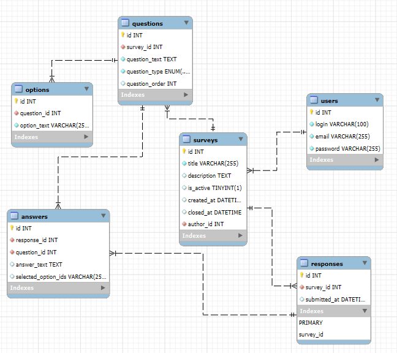

# Проєктування бази даних

В рамках проекту розробляється: 
- модель бізнес-об'єктів 
- ER-модель
- реляційна схема

## Модель бізнес-об'єктів
@startuml

skinparam style strictuml
left to right direction

' ==================== Users ====================
entity Users #99CC66
entity Users.id #CDE7B0
entity Users.login #CDE7B0
entity Users.email #CDE7B0
entity Users.password #CDE7B0

Users.id --* Users
Users.login --* Users
Users.email --* Users
Users.password --* Users

' ==================== Surveys ====================
entity Surveys #FFCC66
entity Surveys.id #FFE7B0
entity Surveys.title #FFE7B0
entity Surveys.description #FFE7B0
entity Surveys.is_active #FFE7B0
entity Surveys.created_at #FFE7B0
entity Surveys.closed_at #FFE7B0
entity Surveys.author_id #FFE7B0

Surveys.id --* Surveys
Surveys.title --* Surveys
Surveys.description --* Surveys
Surveys.is_active --* Surveys
Surveys.created_at --* Surveys
Surveys.closed_at --* Surveys
Surveys.author_id --* Surveys

' ==================== Questions ====================
entity Questions #66CCCC
entity Questions.id #B0E7E7
entity Questions.survey_id #B0E7E7
entity Questions.question_text #B0E7E7
entity Questions.question_type #B0E7E7
entity Questions.question_order #B0E7E7

Questions.id --* Questions
Questions.survey_id --* Questions
Questions.question_text --* Questions
Questions.question_type --* Questions
Questions.question_order --* Questions

' ==================== Options ====================
entity Options #FF99CC
entity Options.id #F6C9DD
entity Options.question_id #F6C9DD
entity Options.option_text #F6C9DD

Options.id --* Options
Options.question_id --* Options
Options.option_text --* Options

' ==================== Responses ====================
entity Responses #9999FF
entity Responses.id #CCCCFF
entity Responses.survey_id #CCCCFF
entity Responses.user_id #CCCCFF
entity Responses.submitted_at #CCCCFF

Responses.id --* Responses
Responses.survey_id --* Responses
Responses.user_id --* Responses
Responses.submitted_at --* Responses

' ==================== Answers ====================
entity Answers #6699CC
entity Answers.id #AFCBE9
entity Answers.response_id #AFCBE9
entity Answers.question_id #AFCBE9
entity Answers.answer_text #AFCBE9
entity Answers.selected_option_ids #AFCBE9

Answers.id --* Answers
Answers.response_id --* Answers
Answers.question_id --* Answers
Answers.answer_text --* Answers
Answers.selected_option_ids --* Answers

' ================ Relationships ================
Users "1" -d- "0..*" Surveys : author_id
Surveys "1" -d- "0..*" Questions : survey_id
Questions "1" -d- "0..*" Options : question_id
Surveys "1" -d- "0..*" Responses : survey_id
Users "1" -d- "0..*" Responses : user_id
Responses "1" -d- "0..*" Answers : response_id
Questions "1" -d- "0..*" Answers : question_id

@enduml

## ER-модель

@startuml
' Напрямок для зручності читання
left to right direction
!define table(x) class x << (T,#FFAAAA) >>
!define primary_key(x) <u>x</u>

' Таблиці
table(Users) {
  primary_key(id): INT
  login: VARCHAR(100)
  email: VARCHAR(255)
  password: VARCHAR(255)
}

table(Surveys) {
  primary_key(id): INT
  title: VARCHAR(255)
  description: TEXT
  is_active: BOOLEAN
  created_at: DATETIME
  closed_at: DATETIME
  author_id: INT
}

table(Questions) {
  primary_key(id): INT
  survey_id: INT
  question_text: TEXT
  question_type: ENUM('text', 'single_choice', 'multiple_choice')
  question_order: INT
}

table(Options) {
  primary_key(id): INT
  question_id: INT
  option_text: VARCHAR(255)
}

table(Responses) {
  primary_key(id): INT
  survey_id: INT
  user_id: INT
  submitted_at: DATETIME
}

table(Answers) {
  primary_key(id): INT
  response_id: INT
  question_id: INT
  answer_text: TEXT
  selected_option_ids: VARCHAR(255)
}

' Зв’язки між таблицями
Surveys::author_id --> Users::id
Questions::survey_id --> Surveys::id
Options::question_id --> Questions::id
Responses::survey_id --> Surveys::id
Responses::user_id --> Users::id
Answers::response_id --> Responses::id
Answers::question_id --> Questions::id

@enduml

## Реляційна схема

